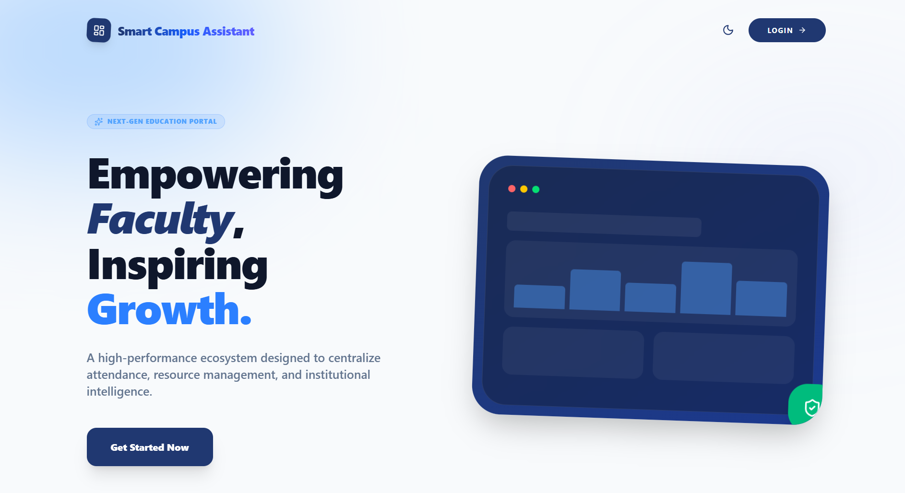
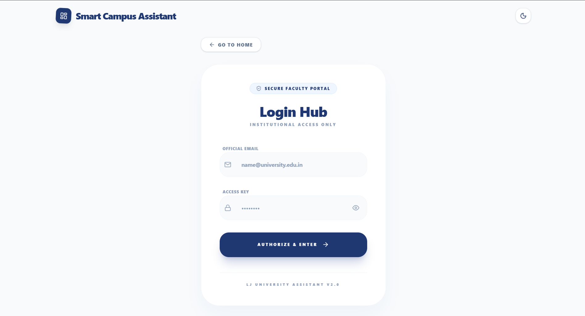

# Smart Campus Assistant - MERN Stack

Smart Campus Assistant is a full-stack MERN web application designed to manage academic and campus-related workflows through separate role-based panels for Admin, Faculty, and Students.

The project focuses on secure authentication, role-based access control, timetable management, attendance workflows, academic data handling, notifications, result management, and clean dashboard-based UI.

---

## Live Links

- Project Live Link : [Open Smart Campus Assistant](https://smart-campus-assistant-eight.vercel.app)

---

## Project Overview

Smart Campus Assistant provides a centralized platform for managing campus operations digitally.

It includes different panels for:

- Admin
- Faculty / Teacher
- Student

Each role has access to specific features based on permissions. The application is built with a scalable MERN architecture and follows a clean separation between frontend, backend, routes, controllers, models, middleware, and services.

This project was originally created as an academic project and has been prepared as a demo-safe MERN portfolio project using anonymized/sample data.

---

## Screenshots

### Home Page

### Login Page

---

## Key Features

### Authentication & Authorization

- User registration and login
- JWT-based authentication
- Secure password hashing using Bcrypt
- Role-based access control
- Protected frontend routes
- Protected backend APIs
- Separate access for Admin, Faculty, and Students

### Additional Features

- Dark mode support
- Timetable conflict detection
- Real-time style notification workflow
- Attendance tracking and reporting

### Admin Panel

- Admin dashboard
- Manage students
- Manage faculty members
- Manage subjects
- Manage timetable data
- Manage attendance-related records
- Manage academic results
- View campus-related data from a centralized dashboard
- Upload academic data using bulk upload features
- Control role-based access and user information

### Faculty / Teacher Panel

- Faculty dashboard
- View assigned subjects
- View timetable
- Manage attendance for assigned lectures
- Access student-related academic data
- View notifications
- Interact with academic workflows through a dedicated faculty interface

### Student Panel

- Student dashboard
- View timetable
- View attendance details
- View subjects
- View academic result information
- View notifications
- Access campus-related information through a clean student interface

### Timetable Management

- Structured timetable management
- Subject-wise scheduling
- Faculty-wise lecture allocation
- Student-side timetable viewing
- Faculty-side timetable viewing
- Admin-side timetable management
- Support for academic scheduling workflows

### Attendance Management

- Attendance-related workflow support
- Faculty-side attendance handling
- Student-side attendance viewing
- Attendance records stored in MongoDB
- PDF/report generation support for attendance data
- Demo-safe data can be used for public deployment

### Notification System

- Role-based notification support
- Admin-to-user communication workflow
- Student and faculty notification views
- Centralized notification handling

### Bulk Upload Support

- Bulk upload support for academic data
- CSV-based data insertion workflow
- Useful for adding users, timetable, subjects, and academic records
- Helps quickly populate demo or academic databases

### Frontend Features

- Clean and responsive user interface
- Dashboard-based layout
- Role-based navigation
- Reusable React components
- Form validation
- Error handling
- Fast routing using React Router
- API integration using Axios

### Security Features

- JWT authentication
- Password hashing with Bcrypt
- Protected routes
- Middleware-based API protection
- Role-based authorization
- Environment variables for sensitive configuration
- Demo mode support for safe public deployment

---

## Tech Stack

### Frontend

- React.js
- React Router DOM
- Axios
- JavaScript
- CSS / Tailwind CSS / Bootstrap
- Vite

### Backend

- Node.js
- Express.js
- MongoDB
- Mongoose
- JWT
- Bcrypt.js
- Multer / File Upload Support
- dotenv

### Integrations / Services

- Cloudinary support for file or image uploads
- Email service support
- SMS service support
- PDF/report generation support

### Tools

- Git
- GitHub
- Postman
- VS Code
- MongoDB Atlas
- Vercel
- Render

---

## Project Structure

    Smart-Campus-Assistant-MERN/
    |
    |-- frontend/
    |   |-- src/
    |   |   |-- components/
    |   |   |-- pages/
    |   |   |-- services/
    |   |   |-- context/
    |   |   |-- assets/
    |   |   `-- App.jsx
    |   |
    |   |-- public/
    |   |-- package.json
    |   `-- vite.config.js
    |
    |-- backend/
    |   |-- config/
    |   |-- controllers/
    |   |-- middleware/
    |   |-- models/
    |   |-- routes/
    |   |-- services/
    |   |-- utils/
    |   |-- server.js
    |   `-- package.json
    |
    |-- screenshots/
    |-- .gitignore
    |-- README.md
    `-- package.json

---

## Demo Credentials

Recommended demo accounts:

    Name: Student
    Email: student@campus.com
    Password: Abcd@1234

Note: These credentials are only for demo deployment with sample data.

---

## Deployment

Recommended deployment setup:

    Frontend: Vercel
    Backend: Render
    Database: MongoDB Atlas

---

## Demo Safety Notes

This project is prepared as a demo-safe portfolio project.

- Real academic data should not be used in public deployment.
- Demo deployment should use anonymized sample data.
- Private documents, PPT files, PDFs, and college-related documentation should not be committed to GitHub.
- Sensitive credentials must be stored only in deployment dashboards such as Render and Vercel.
- .env files are not included in the repository.

---

## Future Enhancements

- Payment integration for academic fees and campus services
- Online exam integration with secure assessment workflows
- Advanced result analysis with performance insights
- First-rank and second-rank highlighting based on academic performance
- AI-powered 24/7 student and faculty helper
- Smart academic recommendations based on attendance, results, and timetable data
- Advanced reporting dashboard for admins
- Mobile app integration for Android and iOS

---

## Developer

    Name: Harshrajsinh Vaghela
    Role: MERN Stack Developer
    Project: Smart Campus Assistant - MERN Stack
    Location: Ahmedabad, Gujarat, India

GitHub: [harshrajsinhvaghela7586](https://github.com/harshrajsinhvaghela7586)

Portfolio: [Harshrajsinh Vaghela Portfolio](https://portfolio-seven-beige-78.vercel.app/)

LinkedIn: [Harshrajsinh Vaghela](https://www.linkedin.com/in/harshrajsinh-vaghela-a38bba300/)

---

## License

This project is developed for academic learning and portfolio demonstration purposes.

---

## Acknowledgement

Thank you for checking out this project.

If you found this project useful or interesting, feel free to star the repository.
